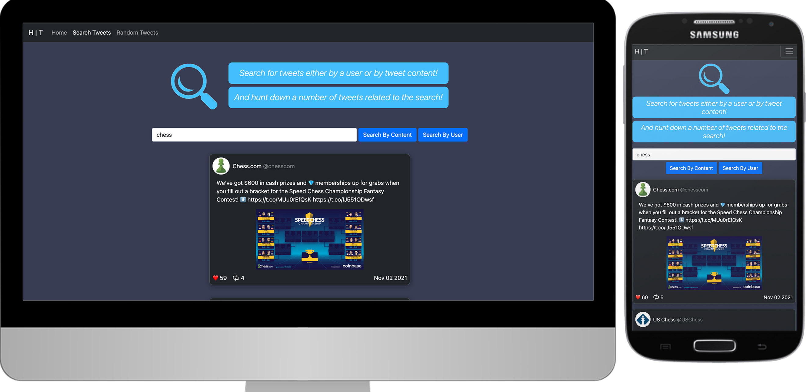

# Full Stack Twitter Showcase App (Fully responsive)

A full stack, fully responsive application which retrieves data from Twitter API in the node server, and utilizes it in the front end that is built with React  

Technologies used: HTML, CSS, JS, Node, Express, React, Bootstrap

### NOTE: Searches do not return any results currently, because twitter stopped providing their APIs for free.

<!-- [See live render](https://twitter-showcase-app-hif9.onrender.com/) -->

### App preview

<!--  -->

* Search Page   
  * Allows user to search for a twitter username or by tweet content
  * If a user searches for a twitter user/content that doesn’t exist, they will be notified with a no result message
  * The search results that are displayed looks “twitter-like”. 
* Random tweet showcase page
topics  
  * Have 5 of my favorite users on twitter and when prompted, randomly chooses a tweet from any of those five users and displays it
* Any tweet that is displayed in the application includes:
  * The full text of the tweet
  * The username of the twitter user who authored the tweet
  * At least one image (if an image was attached)
  * At least one video (if a video was attached)
  * The retweet count
  * The “hearted” (favorited) count

Author: Emin Muratoglu, Full Stack Software Developer  
[Linkedin](https://linkedin.com/in/emin-muratoglu-ba287516b)
